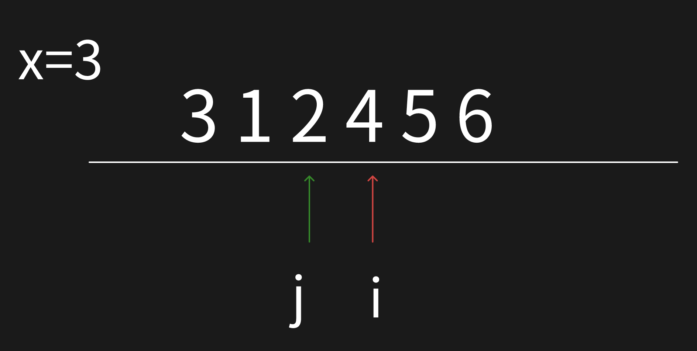
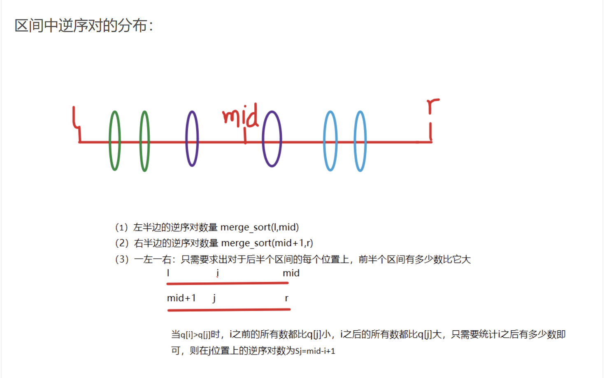
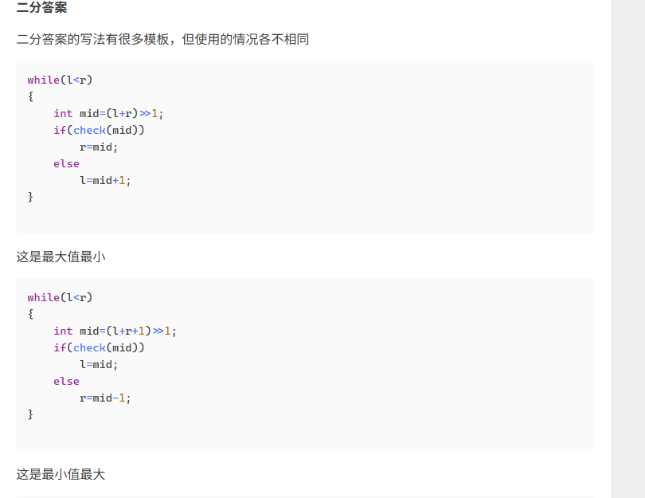
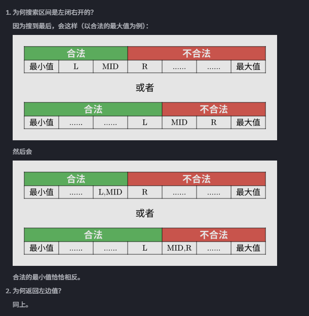
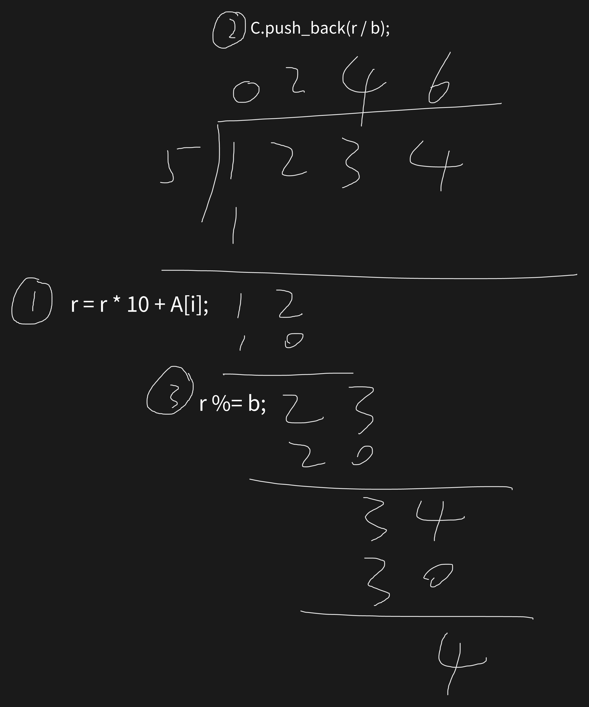
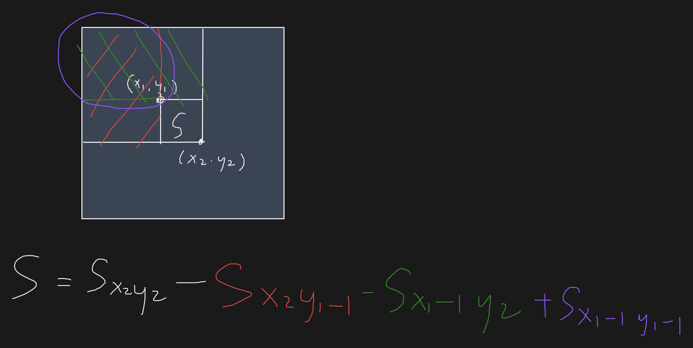
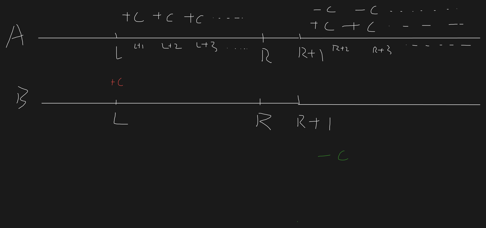
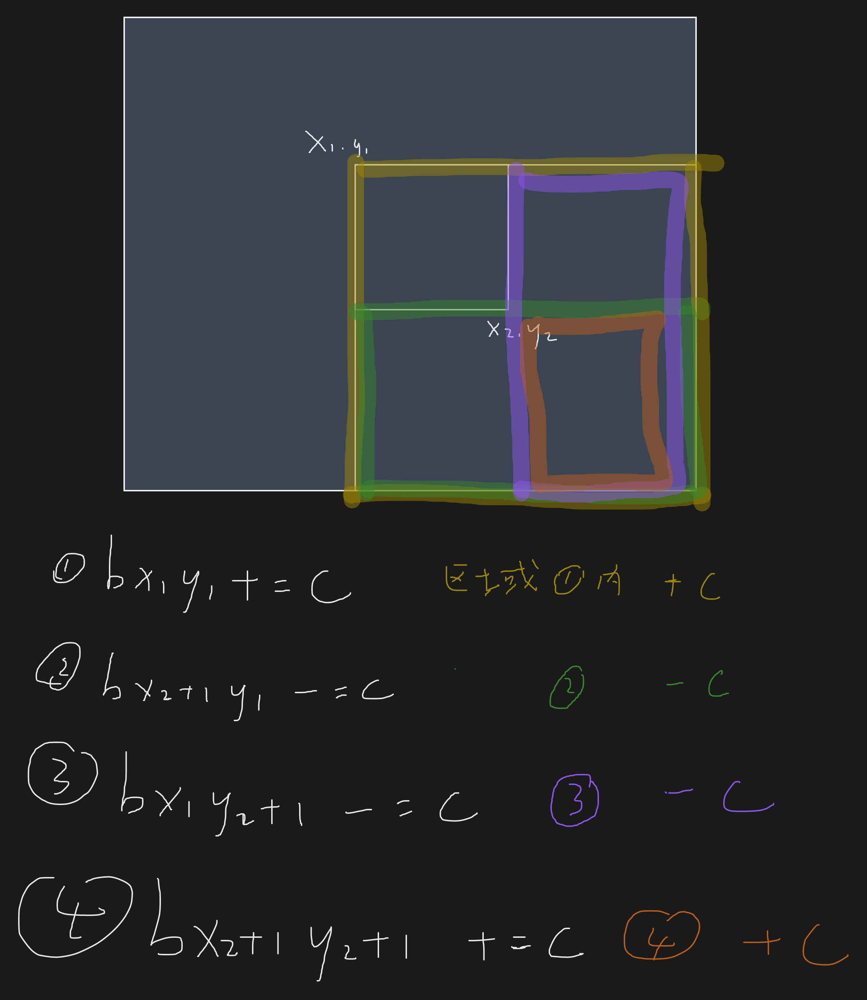
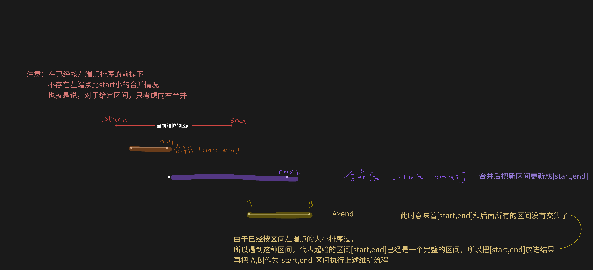

# 排序

> [!NOTE]
> [排序题单](https://www.luogu.com.cn/training/107#problems)

## 快速排序

> 最坏时间复杂度：O(nlogn)

### 基本步骤

1. 确定比较的值 x（通常为左右端点的值/中间点的值）
2. 将整区间划分为两部分，使分界点左侧的元素都小于 x，右侧都大于 x  
做法：定义两个指针，由两个端点向中间遍历，当左指针遇到大于 x 的数时停下，右指针遇到小于 x 的数时停下，swap，继续向中间移动，移动到两指针相遇。此时满足左指针左侧的数值都小于 x，右指针右侧的数都大于 x



3. 递归处理左侧和右侧

### 模板

```cpp
void quick_sort(int q[], int l, int r)
{
    if (l >= r) // 区间里没有数或只有一个数
        return;

    int x = q[l], i = l - 1, j = r + 1;
    // 下面用j做范围来递归时，x不能取到r，否则会有边界问题
    // i和j此处放在数组边界的两侧，防止后续越界，因为下面要先移动指针再判断，有可能会移出去
    while (i < j) // i和j迭代
    {
        do
            i++; // 向右移动i
        while (q[i] < x);
        do
            j--; // 向左移动j
        while (q[j] > x);
        **if (i < j)** // **两个指针不相遇时，**swap
            swap(q[i], q[j]);
    }
    quick_sort(q, l, j);     // 处理区间【原数组左边界,j】的数据
    quick_sort(q, j + 1, r); // 处理区间【j+1,原数组右边界】的数据
}

// quick_sort(q,0,n-1)
```

### C 标准库实现的快速排序-qsort()

`void qsort( void *ptr, count, size, cmp);`
以升序排序 ptr 指向的给定数组。该数组包含 count 个元素，每个元素占用 size 字节。
**cmp 为比较函数，如果第一个参数“小于”第二个参数，则返回负整数值；如果第一个参数“大于”第二个参数，则返回正整数值；如果参数相等，则返回零。**

## 归并排序

### 基本步骤

1. 取整个数组的中间位置 mid 作为分界点
2. 递归排序[L,mid]和[mid+1,R]
3. 将左右两个有序序列归并成一个有序序列

### 归并的实现流程

定义临时的数组用来存储结果，定义双指针
1. 比较两个指针指向的更小的数，把较小的数存入结果数组
2. 迭代指向较小的数的指针，重复进行第一步
3. 当有一边没迭代完而另一边已经停下的时候，直接把没循环完的那边接在后面
4. 完成归并后，结果存回原数组

> 注意：tmp[0]对应 arr[l]，迭代 r-l+1 次

### 模板

```cpp
void merge_sort(int arr[], int l, int r)
{
    if(l >= r) return;
    
    int mid = l + r >> 1; //确定分界点
    
    merge_sort(arr,l,mid); 
    merge_sort(arr,mid+1,r); //递归进行排序，此时整个数组已经被分成了各段有序的小数组
    
    int k = 0, i = l,j = mid + 1; //定义双指针，i指向左半边起点，j指向右半边起点
    
    //归并，合二为一
    while(i <= mid && j <= r) //左半边和右半边不为空
    {
        if(arr[i] < arr[j]) tmp[k++] = arr[i++]; //比较i，j指向的数，把较小的数放到当前位置上并迭代指针
        **else** tmp[k++] = arr[j++]; //注意别忘写else，算进等于的情况
    }
    
    //扫尾
    //当有一边没循环完而另一边已经停下的时候，直接把没循环完的那边接在后面
    while(i <= mid) tmp[k++] = arr[i++];
    while(j <= r) tmp[k++] = arr[j++];
    
    for(i = l, j = 0; i <= r; i++, j++) arr[i] = tmp[j]; //把临时存储的结果存回arr
}

//merge_sort(arr,0,n-1)
```

### 逆序对问题

**[https://www.acwing.com/problem/content/description/790/](https://www.acwing.com/problem/content/description/790/)**\
**[https://www.luogu.com.cn/problem/P1116](https://www.luogu.com.cn/problem/P1116)**

> [!TIP]
> 注意：第三种情况，每次要输出 q[j]时，向答案里加 mid-i+1
> 

```cpp
#include <bits/stdc++.h>
using namespace std;
typedef long long ll;
int arr[100010],tmp[100010];

ll merge_sort(int arr[], int l, int r)
{
    ll res = 0;
    if(l >= r) return 0;
    int mid = l + r >> 1;
    
    res += merge_sort(arr,l,mid);
    res += merge_sort(arr,mid+1,r);
    
    int k = 0, i = l, j = mid + 1;
    while(i <= mid && j <= r)
    {
        if(arr[i] <= arr[j]) tmp[k++] = arr[i++];
        else
        {
            tmp[k++] = arr[j++];
            res += mid - i + 1;
        }
    }
    
    while(i <= mid) tmp[k++] = arr[i++];
    while(j <= r) tmp[k++] = arr[j++];
    
    for(i = l, j = 0; i <= r; i ++, j ++) arr[i] = tmp[j];
    
    return res;
    
}
int main()
{
    int n;
    scanf("%d", &n);
    for(int i = 0; i < n; i ++)
    {
        scanf("%d", &arr[i]);
    }
    
    ll res = merge_sort(arr,0,n-1);
    cout << res << endl;
    return 0;
}
```

## 堆排序

[https://oi-wiki.org/basic/heap-sort/](https://oi-wiki.org/basic/heap-sort/)

> 不稳定，时间复杂度 `O(nlogn)`

```cpp
#include <bits/stdc++.h>
using namespace std;

int n; // 需排序的数的总数
const int N = 1e5 + 10;
int heap[N], size;

void down(int k)
{
    int t = k;

    if (k * 2 <= size && heap[2 * k] < heap[t])
        t = 2 * k;
    if (k * 2 + 1 <= size && heap[2 * k + 1] < heap[t])
        t = 2 * k + 1;

    if (t != k)
    {
        swap(heap[t], heap[k]);
        down(t);
    }
}
int main()
{
    cin >> n;
    size = n;

    for (int i = 1; i <= n; i++)
        cin >> heap[i]; // 输入所有数

    for (int i = n / 2; i >= 1; i--) // 建堆
        down(i);

    while (n--)
    {
        // 输出堆头
        printf("%d ", heap[1]);

        // 删除堆头
        heap[1] = heap[size];
        size--;
        down(1);
    }
    return 0;
}
// 变量名写size有的编译器会报错
```

## STL 的 sort()

### 基本用法

> [!TIP]
> **Start 和 end 为排序区间的首尾地址**

- 默认升序：`sort(start, end)`
- 降序：`sort(start, end, greater<T>())`
- 自定义比较：`sort(start, end, cmp)`（`cmp` 为比较函数或 lambda 表达式）
- 注：给 pair 排序时，sort 默认先排左端点

### cmp 函数的写法

若第一参数在第二参数之前排序，则返回 true。
返回 true 的时候，代表两个比较对象的位置正确，不需要交换
注意：比较函数不可修改传递给它的对象

```cpp
bool cmp(type &a,type &b)
{
    return a>b; //降序，第一个最大
    or
    return a<b; //升序，第一个最小
    //大的在前写大于，小的在前写小于
}
```

# 二分

> 时间复杂度：O(logn)

> [!TIP]
> 是否可以使用二分法的关键在于：二分后，能否判断出答案所在的区间，而不是数据是否有序。

## 整数二分查找（全闭区间写法）

> **例题（用到了两种模板）：****[https://www.acwing.com/problem/content/description/791/](https://www.acwing.com/problem/content/description/791/)**** 数的范围**

### 基本步骤

1. 找中间值 mid ，判断 mid 是否满足某种性质
2. 通过 mid 的判断结果更新区间，保证区间里一定有答案
3. 通过区间的划分状况选择模板

### 更新区间的规则

1. 如果 a[mid] > target，target 最后一次出现的位置一定在 a[mid]之前，更新 r：r = mid - 1。
2. 如果 a[mid] <= target，target 最后一次出现的位置可能在 mid 处，也可能在 a[mid]之后，更新 l：l = mid。
3. 直到 l = r 时，区间内只有一个元素，这个元素就是 target 最后一次出现的位置。

### 因 int 下取整而导致的死循环问题

mid 用(l + r) / 2 计算时，如果程序中有 l = mid ,程序会陷入死循环。

mid 用(l + r + 1) / 2 计算时，如果程序中有 r = mid ,程序会陷入死循环。

### 模板

> [!TIP]
> 写 l = mid 时，上面的 mid 要加 1！！
> return 的值是 l/r/mid，具体问题具体分析

```cpp
bool check(int x) {/* ... */} // 检查x是否满足某种性质
 
// 区间[l, r]被划分成[l, mid]和[mid + 1, r]时使用：
// 找最小索引（被查找数第一次出现的位置）
// 最大值最小
int bsearch_1(int l, int r)
{
    while (l < r)
    {
        int mid = l + r >> 1;
        if (check(mid)) r = mid;    // check()判断mid是否满足性质
        else l = mid + 1;
    }
    return l;
}

// 区间[l, r]被划分成[l, mid - 1]和[mid, r]时使用：
// 找最大索引（被查找数最后一次出现的位置）
// 最小值最大
int bsearch_2(int l, int r)
{
    while (l < r)
    {
        int mid = l + r + 1 >> 1; // 补加1防止死循环 
        if (check(mid)) l = mid;
        else r = mid - 1;
    }
    return l;
// 二分结束后，l和r相等，故return二者之一即可
```

## 浮点数二分查找

> **例题：****[https://www.luogu.com.cn/problem/P1024](https://www.luogu.com.cn/problem/P1024)**** 求解一元三次方程**

注意：浮点数二分的左右边界可以做到严格折半，故直接更新区间即可

```cpp
bool check(double x) {/* ... */} // 检查x是否满足某种性质
 
double bsearch_3(double l, double r)
{
    const double eps = 1e-6;   // eps 表示精度，取决于题目对精度的要求，一般比要求的有效数字多两位
    while (r - l > eps) //二分的“停止”条件，需要一个最小单位约束二分的进行，否则无限二分了
    {
        double mid = (l + r) / 2;
        if (check(mid)) r = mid;
        else l = mid;
    }
    return l;
```

## STL 的二分查找函数

C++ 标准库中实现了查找首个不小于给定值的元素的函数 `std::lower_bound` 和查找首个大于给定值的元素的函数 `std::upper_bound`，二者均定义于头文件 <algorithm> 中，返回一个迭代器

- `lower_bound`：在一个有序序列中进行二分查找，返回指向第一个 **大于等于** 𝑥 的元素的位置的迭代器．如果不存在这样的元素，则返回尾迭代器．`lower_bound(v.begin(),v.end(),x)`．
- `upper_bound`：在一个有序序列中进行二分查找，返回指向第一个 **大于** 𝑥 的元素的位置的迭代器．如果不存在这样的元素，则返回尾迭代器．`upper_bound(v.begin(),v.end(),x)`．

二者均采用二分实现，调用前必须保证容器有序。

> lower_bound 的定义是基于“插入”的，而非查找，即在一个非严格单调（存在相等元素）的有序容器中，插入一个数并继续保持容器的有序性，可以插在哪

## 二分答案

> 解题的时候往往会考虑枚举答案然后检验枚举的值是否正确。若满足单调性，则满足使用二分法的条件。把这里的枚举换成二分，就变成了「二分答案」。



例题：[https://www.luogu.com.cn/problem/P1873](https://www.luogu.com.cn/problem/P1873)

```cpp
#include <bits/stdc++.h>
using namespace std;
int a[1000005];
int n, m;

bool check(int k) {  // 检查可行性，k 为锯片高度
  long long sum = 0;
  for (int i = 1; i <= n; i++)       // 检查每一棵树
    if (a[i] > k)                    // 如果树高于锯片高度
      sum += (long long)(a[i] - k);  // 累加树木长度
  return sum >= m;                   // 如果满足最少长度代表可行
}

int find() {
  int l = 1, r = 1e9 + 1;   // 因为是左闭右开的，所以 10^9 要加 1
  while (l + 1 < r) {       // 如果两点不相邻
    int mid = (l + r) / 2;  // 取中间值
    if (check(mid))         // 如果可行
      l = mid;              // 升高锯片高度
    else
      r = mid;  // 否则降低锯片高度
  }
  return l;  // 返回左边值
}

int main() {
  cin >> n >> m;
  for (int i = 1; i <= n; i++) cin >> a[i];
  cout << find();
  return 0;
}
```



## 二分的开区间写法、循环不变量

[https://www.bilibili.com/video/BV1AP41137w7/](https://www.bilibili.com/video/BV1AP41137w7/)

区间的定义：表示我们需要知道这个区间内的元素和 target 的关系

L 和 R 之间就是还没确定大小的数，开和闭决定了边界和最终结束时的位置

无论二分查找还是二分答案，都有“循环不变量”，即在整个二分过程中，始终满足成立的表达式，例如 check(left) == false

每次写二分的时候，用红蓝染色法模拟一遍，判断如何更新区间，并找出循环不变量，判定查找完以后，最后两个指针在哪

```cpp
//假定数组长度为n
int bsearch(int arr[], int l, int r)
{
    l = -1; 
    right = n; // 初始开区间(l,r)，l和r都是无法取到的数
    while(l + 1 < r) // 进入循环的条件：区间不为空
    {
        mid = (l + r) / 2;
        if(check(mid)) l = mid; //(mid,r)
        else r = mid; //(l,mid)
    }
    return r;
}
```

# 高精度

> 原理：用程序模拟竖式运算

## 大整数的 IO

> 由于 c++ 的数据存储类型存在上限，故在存储极大的整数时，可以考虑**用数组/vector 存储每位数的数字**

首先以 string 的形式读入，再把每位数扣下来，放到数组里

为了运算进位方便，应“倒着存”，即个位数位于数组的第一位

> 例如：123456789，应使 a[0]=9，a[9]=1

同理，输出的时候，从数组的最后一位倒着输出

**注意，输出的时候需要去掉答案前面的 0，即前导 0**

### 使用普通数组

```cpp
string a, b;
    int A[1e6],B[1e6];
    cin >> a >> b;
    int lena = a.size(), lenb = b.size();
    for (int i = lena - 1; i >= 0; i--) 
    {
        A[lena - i] = a[i] - '0';
    }
    for (int i = lenb - 1; i >= 0; i--) 
    {
        B[lenb - i] = b[i] - '0';
    }
    //注意此写法A[0]和B[0]没存数，值为0，若使用此种方法，后面应该从1开始遍历
```

### 使用 vector

```cpp
string a, b; 
    vector<int> A, B;
    cin >> a >> b;
    for (int i = a.size() - 1; i >= 0; i -- ) A.push_back(a[i] - '0'); 
    for (int i = b.size() - 1; i >= 0; i -- ) B.push_back(b[i] - '0');
```

## 高精度加法

```cpp
#include <iostream>
#include <vector>

using namespace std;

vector<int> add(vector<int> &A, vector<int> &B) //使用&提高处理效率
{
    vector<int> C;
    
    int t = 0; //负责进位的变量
    for (int i = 0; i < A.size() || i < B.size(); i ++ )
    {
        if (i < A.size()) t += A[i];//判断位置i上有没有数，并加上本身和进位
        if (i < B.size()) t += B[i];
        
        C.push_back(t % 10); //把当前位数放到答案里
        t /= 10; //进位，此时t为0或1
    }

    if (t) C.push_back(t); //最高位的进位，若最后一轮t>10，则/=10后不为0，此时最高位进1
    return C;
}

int main()
{
    string a, b; // 读入两个大整数
    vector<int> A, B; //存储两个大整数的数组
    cin >> a >> b;
    for (int i = a.size() - 1; i >= 0; i -- ) A.push_back(a[i] - '0'); //倒序存位数，-'0'是把字符变成整数
    for (int i = b.size() - 1; i >= 0; i -- ) B.push_back(b[i] - '0'); 

    vector<int> C = add(A, B);//可使用auto等价vector<int>

    for (int i = C.size() - 1; i >= 0; i -- ) cout << C[i]; //倒着输出
    cout << endl;

    return 0;
}
```

## 高精度减法

### 注意事项

1. IO 时，注意先判断 A 和 B 的大小关系，若 A<B 则算 B-A，在输出时加负号
2. 模拟减法运算思路时，注意是倒着算的，也就是对于 vector 里面存的数，是向后一位借 1
3. 注意返回结果前，需要去掉前面的 0，例如 123-120 的结果实际上是 003

### 模板（a，b 均为正数）

```cpp
#include <iostream>
#include <vector>
using namespace std;

bool cmp(vector<int> &A, vector<int> &B) //比较两个数谁大，以确定谁是被减数
{
    if(A.size() != B.size()) return A.size() > B.size();
    for(int i = A.size() - 1; i >= 0; i --)
        if(A[i] != B[i])
            return A[i] > B[i];
    return true;
}

vector<int> sub(vector<int> &A, vector<int> &B)
{
    vector<int> C;
    for(int i = 0, t = 0; i < A.size(); i++)
    {
        t = A[i] - t; //第i位A的值，考虑是否被前一位借走了1
        
        if(i < B.size()) t -= B[i]; //判断B在这一位上有没有数，有的话就减
        
        C.push_back((t + 10) % 10); //存这一位的结果，t>=0时输出t，t<0时输出(t+10)
        
        if(t < 0) t = 1; //若t小于0，则需要借位
        else t = 0;
    }
    
    **while(C.size() > 1 && C.back() == 0) C.pop_back(); //减法做完后，去掉前导0**
    return C;
}

int main()
{
    string a, b;
    vector<int> A, B;
    cin >> a >> b;
    for (int i = a.size() - 1; i >= 0; i -- ) A.push_back(a[i] - '0');
    for (int i = b.size() - 1; i >= 0; i -- ) B.push_back(b[i] - '0'); 

    if(cmp(A,B)) //比较A，B的大小
    {
        auto C = sub(A,B);
        for (int i = C.size() - 1; i >= 0; i -- ) cout << C[i];
        cout << endl;
    }
    else //若A<B则算B-A，在输出时加负号
    {
        auto C = sub(B,A);
        cout << "-";
        for (int i = C.size() - 1; i >= 0; i -- ) cout << C[i];
        cout << endl;
    }
    
    return 0;
}
```

## 高精度乘法

高精度乘法的进位既可以边迭代边处理，也可先相乘每位，后处理进位。

### 高精度乘低精度（同时完成乘法和进位）

> [!TIP]
> 在高精度的乘法运算中，计算过程类似于下表达式。
> 例如，251*6 = 1*6*1 + 5*6*10 + 2*6*100 = 1506
> 第一个数代表高精度数组每一位所存放的数
> 第二个数代表低精度的数，所以高精度的数组的每一位都要乘一遍低精度的数
> 第三个数即为数组中存放的顺序，即 a[0]代表个位，a[1]代表十位，a[2]代表百位，等等

```cpp
// C = A * b, A >= 0, b > 0
vector<int> mul(vector<int> &A, int b)
{
    vector<int> C;
    int t = 0; //表示进位
    for (int i = 0; i < A.size() || t; i ++ ) //i循环完或t为0时停止循环，因此停止循环时t必为0
    {
        if (i < A.size()) t += A[i] * b; //每一位的值要加上上一位的进位
        C.push_back(t % 10); //取乘法运算的个位作为当前结果
        t /= 10;
    }
    while(C.size() > 1 && C.back() == 0) C.pop_back();//去掉前导0
    return C;
}
```

### 高精度乘高精度（先算乘法，后进位）

#### 思路

1. 枚举 A 和 B 的每一位，并把 A 和 B 的每一位都进行相乘，储存在数组 C 里。
2. 遍历数组 C，当前位等于 %10，下一位 +=当前位/10
3. 去掉前导 0

#### 模板

```cpp
vector<int> mul(vector<int> &A, vector<int> &B)
{
    vector<int> C(1e6);
    for (int i = 0; i < A.size(); i++) 
        for (int j = 0; j < B.size(); j++)
            C[i + j] += A[i] * B[j]; //计算乘积
            
    for (int i = 0; i < A.size() + B.size(); i++) //处理进位
    {
        C[i + 1] += C[i] / 10;
        C[i] %= 10;
    }
    while (C.size() > 1 && C.back() == 0) C.pop_back();
    return C;
}
```

## 高精度除法

> [!TIP]
> 注意：除法的运算与前三种运算不同，是从最高位开始的，但是实际问题中通常混合不同运算，所以仍然要倒着存进 vector，但从 vector 的最后一位开始运算

### 高精度除低精度

> [!TIP]
> reverse 的原因：当做完除法运算时，此时的前导 0 位于 vector 的开头，但是 vector 删除第一个元素不方便，所以 reverse，并用 pop_back 去除最后一个元素
> 而输出的时候是倒着输出，最后就会负负得正，输出正确的结果
> 注意部分题目中，余数可能整型溢出！



```cpp
#include <iostream>
#include <vector>
#include <algorithm>

using namespace std;

vector<int> div(vector<int> &A, int b, int &r) //传引用
{
    vector<int> C;
    r = 0;
    for(int i = A.size() - 1; i >= 0; i--)
    {
        r = r * 10 + A[i]; 
        C.push_back(r / b);
        r %= b;
    }
    
    **reverse(C.begin(), C.end());**
    
    while(C.size() > 1 && C.back() == 0) C.pop_back();
    return C;
}

int main()
{
    string a;
    vector<int> A;

    int B;
    cin >> a >> B;
    for (int i = a.size() - 1; i >= 0; i -- ) A.push_back(a[i] - '0');

    int r; //余数
    auto C = div(A, B, r);

    for (int i = C.size() - 1; i >= 0; i -- ) cout << C[i]; //注意倒着输出

    cout << endl << r << endl;

    return 0;
}
```

## 高精度例题——计算阶乘和（高精度乘低精度，高精度加法）

[https://www.luogu.com.cn/problem/P1009](https://www.luogu.com.cn/problem/P1009)

```cpp
#include <bits/stdc++.h>
using namespace std;
int arr[1000], res[1000];
int main()
{
    int n;
    cin >> n;
    arr[0] = res[0] = 1;
    for (int i = 2; i <= n; i++)
    {
        for (int j = 0; j <= 100; j++)
        {
            res[j] *= i; //注意每一位都要乘i
        }
        for (int j = 0; j <= 100; j++) //处理乘法后的进位，即把结果按位存放在res里
        {
            if (res[j] > 9)
            {
                res[j + 1] += res[j] / 10;
                res[j] %= 10;
            }
        }
        for (int k = 0; k < 100; k++)
        {
            arr[k] += res[k]; //高精度加高精度
            if (arr[k] > 9) //处理加法后的进位
            {
                arr[k + 1] += arr[k] / 10;
                arr[k] %= 10;
            }
        }
    }
    int len = 100;
    for (int i = 100; i >= 0; i--) //去掉前导0
    {
        if (arr[i] != 0)
            break;
        else
            len--;
    }
    for (int i = len; i >= 0; i--)
        cout << arr[i];
    return 0;
}
```

# 前缀和与差分

> 前缀和与差分互为逆运算

**注意：前缀和与差分数组序列初始化时，下标应当从 1 开始。并初始化第 0 位为 0**

**此写法可确保递推公式的普遍性，不需要特判 l=1 的情况**

## 前缀和

> 前缀和可以简单理解为「数列的前 n 项的和」，是一种重要的预处理方式。
> 例如：a6 + a7 + a8 = S8 - S5
> 通过 𝑂(𝑛) 时间的预处理，能够将单次查询 [l ,r] 区间和的复杂度降低到 𝑂(1)

### **一维前缀和**

- 一维前缀和数组的初始化：

`for (int i = 1; i <= n; i ++ ) s[i] = s[i - 1] + a[i];`

**（前 i 个数的和=前 i-1 个数的和 + 第 i 个数）**

- 区间 [l ,r] 的元素和：

`s[r] - s[l - 1]`

### 二维前缀和

- 二维前缀和数组的初始化：

`sum[i][j] = sum[i-1][j] + sum[i][j-1] - sum[i-1][j-1] + arr[i][j]`

- 二维前缀和的求和公式：

`sum[x2][y2] - sum[x1-1][y2] - sum[x2][y1-1] + sum[x1-1][y1-1]`



## 差分

> 差分是一种与前缀和相对的策略，是前缀和的逆运算。相较于给定某一序列求它的差分，竞赛中更为常见的情景是，通过维护差分序列的信息，实现多次区间修改。在区间修改结束后，可以通过前缀和恢复原序列的信息，实现对原序列的查询。注意修改操作一定要在查询操作之前。**—— OI wiki**
> (常常用于维护多次对序列的一个区间加上一个数，并在之后一次或多次询问序列某一位的取值)

### 一维差分

#### 基本思路

给定一个数组 a，现要构造一个 b 数组，使得 ai = b1 + b2 + ... + bi

> 即对于序列 ai，它的差分序列是：𝐷𝑖=𝑎𝑖−𝑎(𝑖−1), 𝑎0=0
> 也可知，ai 序列是 bi 序列的前缀和

完成操作后，需要求差分序列的前缀和以恢复被修改的原序列

#### 一维差分序列的插入操作

```cpp
void insert(int l, int r, int c)
{
    b[l] += c;
    b[r + 1] -= c;
}
```



构造时：`for(int i = 1; i <= n; i++) insert(i,i,a[i]);` //a[i]为原数组

#### 例题-Acwing797

[https://www.acwing.com/problem/content/799/](https://www.acwing.com/problem/content/799/)

> 输入一个长度为 n 的整数序列。
> 接下来输入 m 个操作，每个操作包含三个整数 l,r,c，表示将序列中 [l,r] 之间的每个数加上 c。
> 请你输出进行完所有操作后的序列。
> **输入格式**
> 第一行包含两个整数 n 和 m。
> 第二行包含 n 个整数，表示整数序列。
> 接下来 m 行，每行包含三个整数 l，r，c，表示一个操作。
> **输出格式**
> 共一行，包含 n 个整数，表示最终序列。

```cpp
#include <bits/stdc++.h>
using namespace std;
const int N = 100010;
int n,m,a[N],b[N];
void insert(int l, int r, int c)
{
    b[l] += c;
    b[r + 1] -= c;
}
int main()
{
    scanf("%d%d", &n, &m);
    for(int i = 1; i <= n; i++) scanf("%d", &a[i]);
    for(int i = 1; i <= n; i++) insert(i,i,a[i]); //差分序列的初始化，看作在b数组的[i,i]区间内插入a[i]
    //b[2]首先-=了a[1]，再+=了a[2]，则有b[2] = a[2] - a[1]，下面以此类推
    
    while(m--)
    {
        int l, r, c;
        scanf("%d%d%d", &l, &r, &c); //对于m次操作，在差分序列上+c
        insert(l,r,c);
    }
    
    for(int i = 1; i <= n; i++) b[i] += b[i-1];//对已经修改过的差分数组求前缀和，得到原数组修改后的结果
    for(int i = 1; i <= n; i++) printf("%d ", b[i]);
    return 0;
}
```

### 二维差分

#### 基本思路

> [!TIP]
> 完成操作后，需要求差分序列的前缀和，把差分序列恢复成被修改的原序列

#### 二维差分序列的插入函数

```cpp
void insert(int x1, int y1, int x2, int y2, int c)
{
    b[x1][y1] += c;
    b[x2 + 1][y1] -= c;
    b[x1][y2 + 1] -= c;
    b[x2 + 1][y2 + 1] += c;
}

构造时：for(int i = 1; i <= n; i++)
            for(int j = 1; j <= m; j++)
                insert(i, j, i, j, a[i][j]); //a[i][j]为原数组
```



#### 例题-Acwing798

[https://www.acwing.com/problem/content/800/](https://www.acwing.com/problem/content/800/)

# 位运算

[https://oi-wiki.org/math/bit/](https://oi-wiki.org/math/bit/)

> 对于左移操作，需要确保移位后的结果能被原数的类型容纳，否则行为也是未定义的。对一个负数执行左移操作也未定义。左移一位相当于*2
> 对于右移操作，右侧多余的位将会被舍弃，而左侧较为复杂：对于无符号数，会在左侧补 0；而对于有符号数，则会用最高位的数（其实就是符号位，非负数为 0，负数为 1）补齐。
> 算术右移一位相当于除以 2 并向下取整

## 求一个十进制数 n 的二进制表示的第 k+1 位

1. 把第 k 位移到最后一位，n >> k（将 n 的 2 进制向右移 k 位）
2. 看个位是多少的做法：n 按位与 1, n & 1

**即有公式：n >> k & 1**

## lowbit 操作

```cpp
int lowbit(int x) {
  // x 的二进制中，最低位的 1 以及后面所有 0 构成的数值。
  // lowbit(0b01011000) == 0b00001000
  //          ~~~~^~~~
  // lowbit(0b01110010) == 0b00000010
  //          ~~~~~~^~
  return x & -x; // x二进制的最后一位1的位置
}
```

### 功能

lowbit(x)：返回 x 二进制的最后一位 1 的位置（实质上为 x & -x）

> x = 1010,  lowbit(x) = 10
> x = 1010000,  lowbit(x) = 10000

### 函数实现的原理

x & -x = x & (~x+1）

> -x 相当于 x 取反加 1，原码反码补码的知识。

# 区间合并

> 给定 n 个区间 [l,r]，要求合并所有有交集的区间。
> 注意如果在端点处相交，也算有交集。
> 例如：[1,3] 和 [2,6] 可以合并为一个区间 [1,6]。
> [1,4] 和 [4,6] 可以合并为一个区间 [1,6]。

## **解决方法**

1. 用 pair 存储每个区间，放进 vector pair 数组中
2. 按区间左端点排序
3. 模板（注意代码细节）



## 模板函数

```cpp
typedef pair<int, int> PII;

void merge(vector<PII> &segs)
{
    vector<PII> res;
    sort(segs.begin(), segs.end()); // 排序左端点

    int start = -2e9, end = -2e9;
    // 左右端点初始化成负无穷，保证和所有的给定区间都没有交集

    for (auto seg: segs) // 从小到大扫描所有左端点，开始合并
        if (end < seg.first) // 画板中黄色的情况
        {
            if (start != -2e9) // 特判最开始的情况，因为无穷小，所以必定进入黄色的情况，但不应该把它放进结果
                res.push_back({start, end}); // 把当前区间放入结果
            
            start = seg.first, end = seg.second;
        } 
        else
            end = max(end, seg.second); // 画板中紫色的情况

    if (start != -2e9)
        res.push_back({start, end});
    // 考虑结束循环时的区间，即最后一个左端点。
    // 因为这是最后的一个区间，所以不可能继续进行合并，直接放进结果。
    // 同样，此区间也不能是一开始的负无穷区间

    segs = res; // 把res覆盖到segs里
}
```

# 贡献法

> 想象一下，你面前有一堆问题，比如“计算所有连续子数组的和的总和”。最直接的想法就是把所有子数组都列出来，分别求和再加起来。但这样太慢了，如果数组有 n 个元素，子数组的数量是 O(n²) 级别，当 n 很大时计算量巨大。

对于“计算所有连续子数组的和的总和”的问题，贡献法提供了一种思路：

**我们不直接枚举所有子数组，而是反过来思考每个元素在最终答案中起了多大作用。**

也就是说，我们分析每个元素会被多少个不同的子数组包含，然后把这个元素的值乘以它出现的次数，最后把所有元素的贡献加起来，就得到了答案。

这种方法的核心是**将整体问题拆解成每个独立元素的贡献**，往往能把复杂度从 O(n²) 降到 O(n) 或 O(n log n)。

# 离散化

```cpp
for (int i = 1; i <= n; i++)
        {
            cin >> a[i];
            b[i] = a[i];
        }
    sort(b + 1, b + n + 1);
    l = unique(b + 1, b + n + 1) - b - 1; // l表示去重后剩下的元素个数
    for (int i = 1; i <= n; i++)
        cout << lower_bound(b + 1, b + l + 1, a[i]) - b; // 查找序号并输出
```
